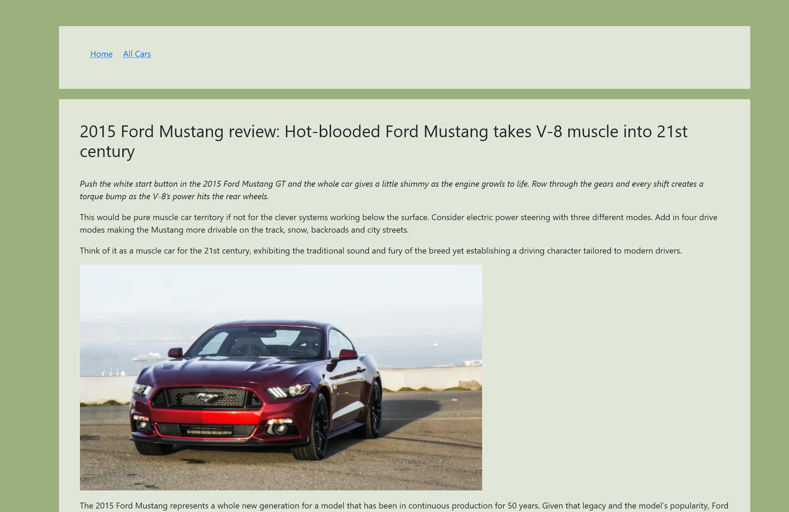

# CarBlogTheme

This is a basic custom WordPress theme compatible with WordPress 6 that supports

● Custom Post-Types: Cars, Case Study Articles

● Custom Post Meta Fields: rental_price, engine_description, suspension_description, comfort_features

● Custom Taxonomies: car_brand, engine_type, car_category, target_audience, study_articles

● Cars Archive page that lists 5 cars per page and supports cars
filtering by custom fields

● Car Single Page that includes links to all case studies belonging to a Car

### Plugins used: ### 
_Custom Post Type UI: Version 1.13.4_ 

_Advanced Custom Fields: Version 6.0.6_

# How does it look? #
## Index Page ##

## Archive Page ##

## Car Single Page ##

## Case Study Article Page ##

